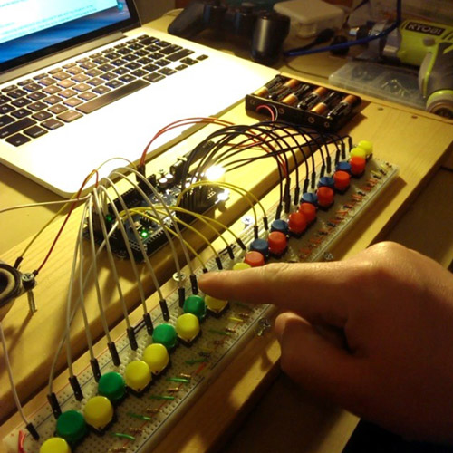

# arduino-keyboard
Code for Arduino Tone Generating Keyboard

This project uses an [Arduino Mega 2560](https://www.arduino.cc/en/Main/ArduinoBoardMega2560)

It features two octaves of Buttons and an up and down Octave Switch which moves the whole keyboard by one Octave. Its powered by battery and has both a speaker and a 1/4" output jack.